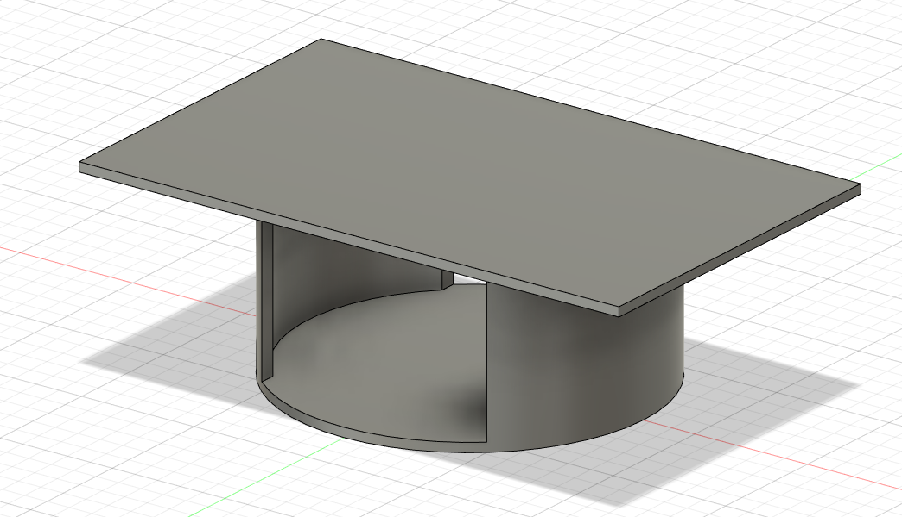
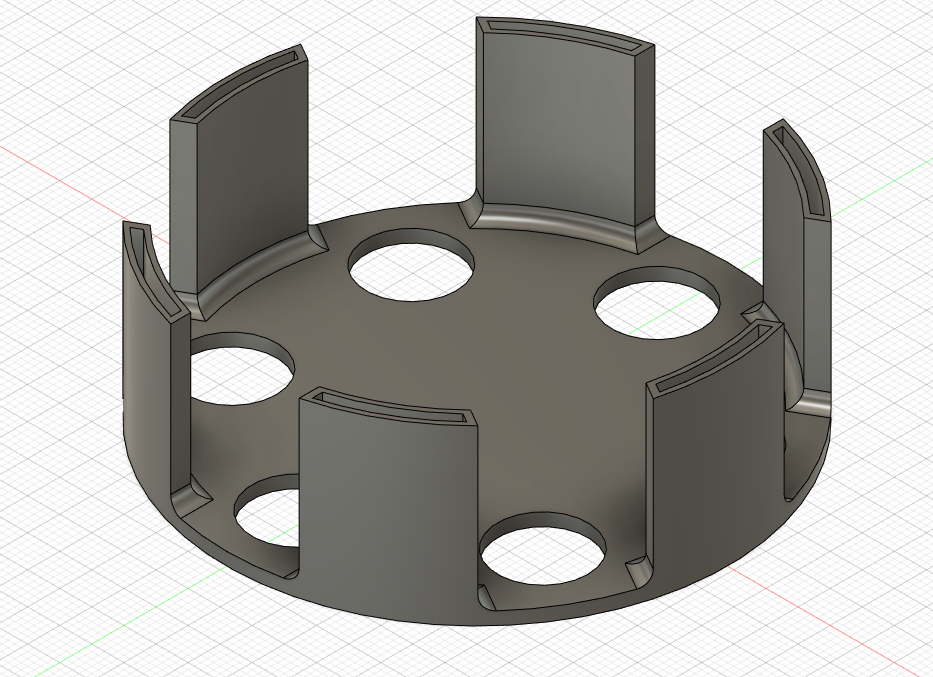
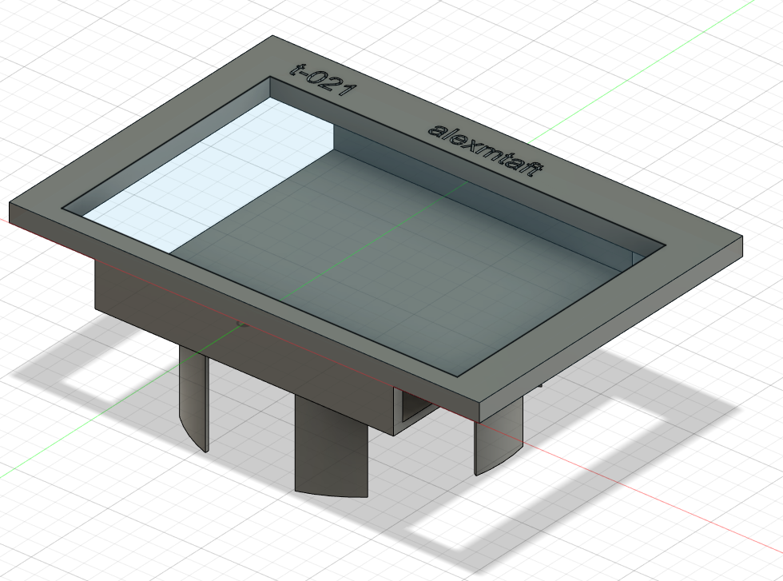
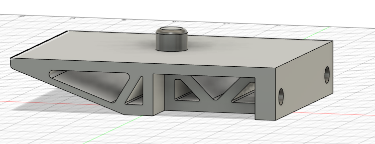
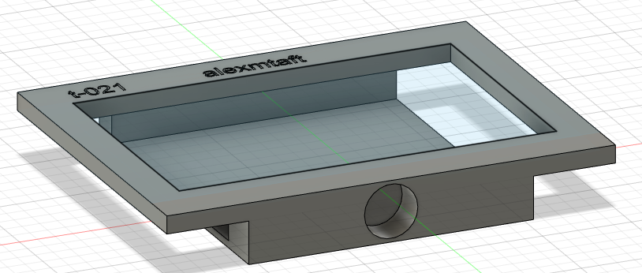

# t-021-racing-sim-dash
sim dashboard using nextion display 

## electronics 

nextion 4.3" dipslay
https://www.amazon.com/dp/B07QWS2N48?psc=1&ref=ppx_yo2_dt_b_product_details

need to use CP2102 USB to TTL Adapter Serial to attach to computer USB
  - was not detected initially by win10, needed to install drivers for it from: https://www.silabs.com/developers/usb-to-uart-bridge-vcp-drivers

https://user-images.githubusercontent.com/6611284/139970841-8c5c60f7-5705-45ea-a678-4e311ac6d1d5.mov

## cad
### v1.0.0: just a draft to get approximate sizing on steering wheel
  - didn't account for the logitech circoelcover fiting inside of the stand -> made diameter too small

### v1.1.0: modular design on steering wheel
  - display could be detatched and re-attached to the base
  - had holes pre-cut so screw could attach to base
  * ended up having to abort this design in the end because the usb cable was intended to go through the middle of 
    the steering column however, the column is too small to fit a usb cable 
    - tried taking about a usb cable to feed through and solder the end back to it but was going to be too difficult
      and the cable would likely break after a while of turning the wheel several hundred degrees

### v2.0.0: attach to side of stand  
  - problems with cabling in v1.1.0 caused me to ditch trying to send the usb cable through the steering wheel.
  instead will attach the base/screen to the side of the wheel stand on a pivot

